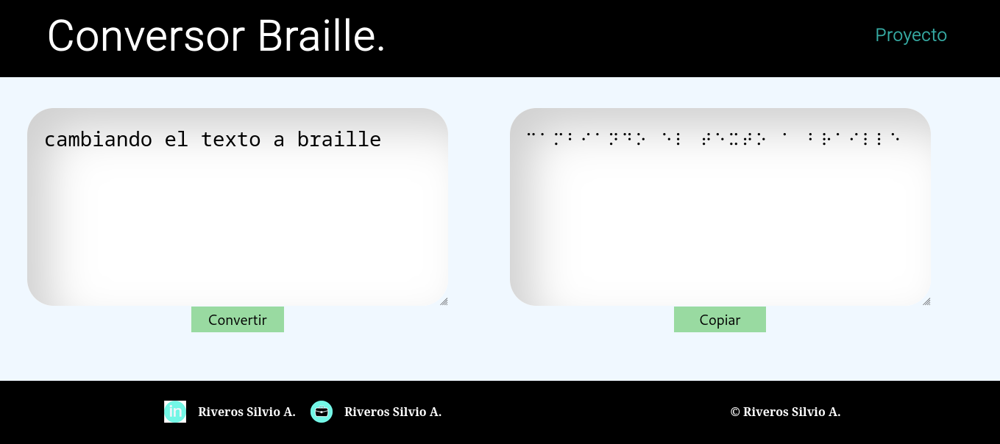
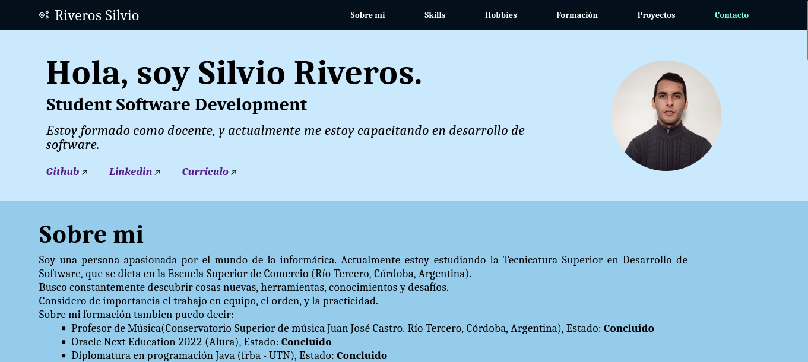

### Riveros Silvio ⚡ 

#### Sobre mí:
- Creo importante trabajar ordenado.
- Analizar a detalle cuando es necesario.
- Considero al trabajo en equipo como una forma de potenciar nuestras habilidades, como así tambień la buena relación con quienes nos rodeamos.
- Me gusta trabajar enfocado en objetivos.
Actualmente estudio la Tecnicatura Superior en Desarrollo de Software, que se dicta en la Escuela Superior de Comercio (Río Tercero, Córdoba, Argentina).
Me apasiona descubrir cosas nuevas, sean herramientas, conocimientos, y enfrentarme a desafíos.
Sobre mi formación puedo decir: 
- Profesor de Música recibido en el año 2022 (Conservatorio Superior de música Juan José Castro. Río Tercero, Córdoba, Argentina)
- Oracle Next Education 2022.
- Diplomatura en programación Java (frba - UTN).
- Formación fullStack (Codo a codo).
- Completé con éxito el primer año de la Tecnicatura Superior en Desarrollo de Software.

> ***Java*** - ***HTML*** - ***CSS*** - ***JAVASCRIPT*** - ***SQL*** - ***MySQL*** -***Python*** - ***Flask*** - 
***Desarrollo Personal*** - ***Bussines Agility*** - ***Gestión de Proyectos***

Lo que encontrarán en mi github:
Un repositorio con el codigo y la imprementación del ***Proyecto Braille***

Un repositorio con el codigo y la imprementación de mi ***Portafolio***

